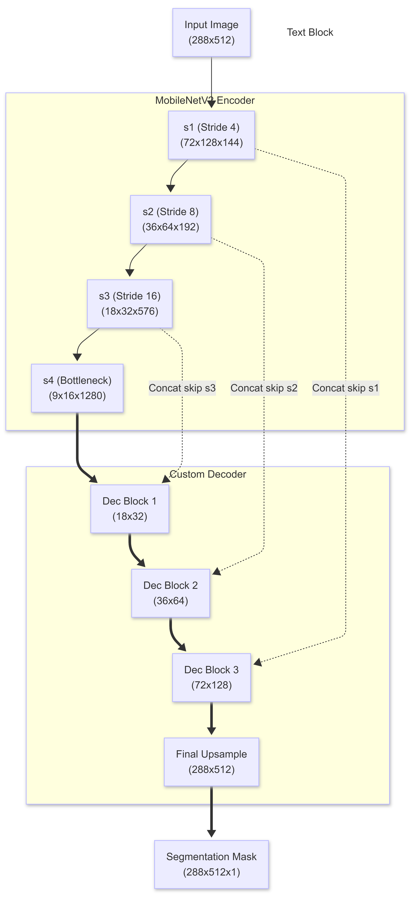
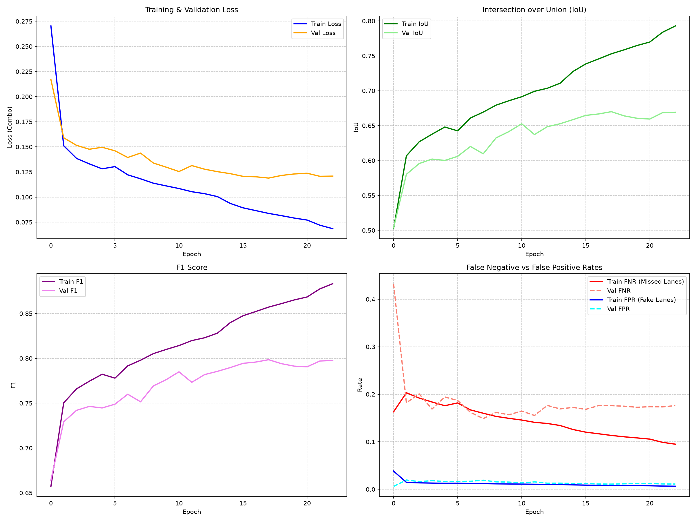
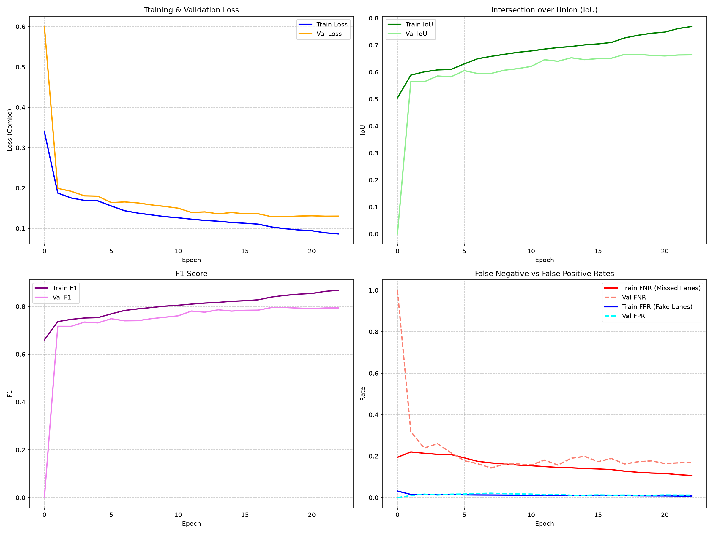
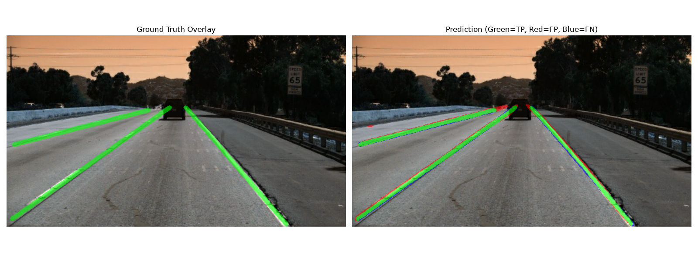
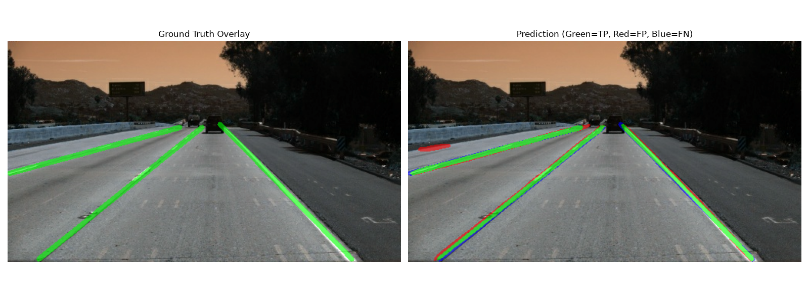
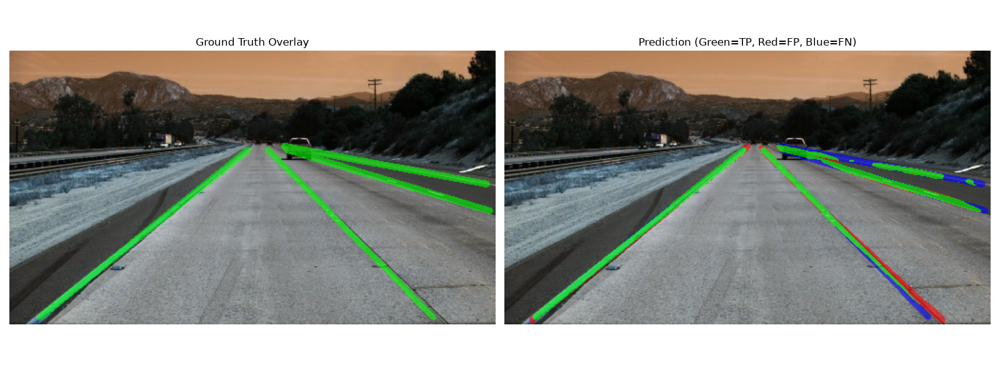
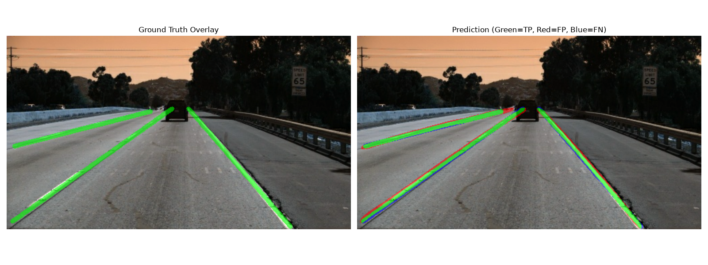
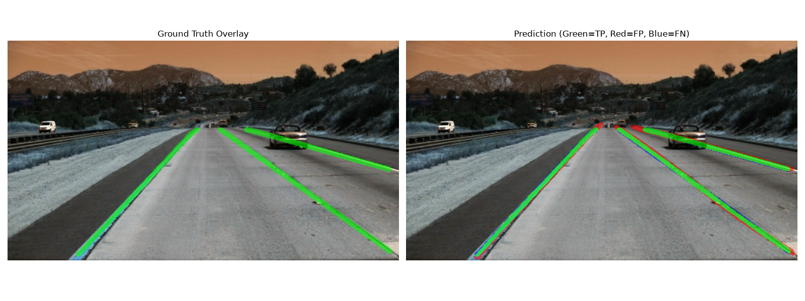

# Lane Detection using U-Net with MobileNetV2 Backbone

A robust Deep Learning pipeline for road lane detection/segmentation built on **TensorFlow/Keras**. The project utilizes a U-Net architecture with a pre-trained **MobileNetV2** encoder to perform pixel-level lane segmentation. It also compares the performance of a baseline model against a regularized version using L2 weight decay.

---

## 📁 Dataset & Preprocessing Pipeline

This project is trained and evaluated on the **TuSimple Lane Detection Dataset**.
> [!NOTE]
> Please download the dataset and give credit to the authors at [Kaggle - TuSimple Dataset](https://www.kaggle.com/datasets/manideep1108/tusimple).

### 1. Raw Dataset Setup & Structure
To start, place the downloaded raw TuSimple dataset under the folder path `data/tusimple/`. The expected directory structure inside `data/tusimple/` (after moving the test labels file) is:

```directory
data/tusimple/
├── test_set/
│   ├── clips/                  # Image frame sequence folders
│   │   └── ...
│   ├── test_label.json         # Test set ground truth annotations (moved here)
│   ├── readme.md
│   └── test_tasks_0627.json
└── train_set/
    ├── clips/                  # Image frame sequence folders
    │   └── ...
    ├── seg_label/              # Pre-rendered ground truth masks
    │   └── ...
    ├── label_data_0313.json    # Annotations part 1
    ├── label_data_0531.json    # Annotations part 2
    ├── label_data_0601.json    # Annotations part 3
    └── readme.md
```

> [!IMPORTANT]
> The raw TuSimple test annotations are downloaded as `test_label_new.json` in the root of the dataset directory. You must move and rename this file into the `test_set/` subdirectory as `test_label.json` for the label merging script to locate it:
> ```bash
> mv data/tusimple/test_label_new.json data/tusimple/test_set/test_label.json
> ```

### 2. Analysis of the Raw Dataset
* **Clips**: The sequential image sequences inside `clips/` represent 20-frame video snippets. Only the last frame of each sequence (the 20th frame) has lane coordinates annotated.
* **Json Labels**: The `label_data_*.json` files contain the coordinate points of the road lanes for training sequences. Key attributes include:
  - `raw_file`: Relative file path to the labeled image frame.
  - `lanes`: A list of lists representing lane coordinate points along the x-axis. A value of `-2` indicates the lane is not present at that height.
  - `h_samples`: Sampling height intervals (y-axis values) corresponding to the x-coordinates in `lanes`.
* **Seg Labels**: Dense ground truth segmentation png images.

### 3. Data Preparation & Splitting Workflow
To set up the training, validation, and testing partitions (`data/train`, `data/val`, and `data/test`), follow the workflow implemented in `scripts/`:

1. **Merge Annotations ([merge_labels.py](scripts/merge_labels.py))**:
   - Aggregates annotations from the individual files (`label_data_0313.json`, `label_data_0531.json`, `label_data_0601.json`, and `test_set/test_label.json`).
   - Standardizes the `raw_file` paths by prefixing `train_set/` or `test_set/`.
   - Saves a combined index to `data/combined_labels.json`.
2. **Preventing Data Leakage via Clip-Based Splitting ([make_split.py](scripts/make_split.py))**:
   - > [!IMPORTANT]
     > Adjacent frames within the same video clip are highly correlated. Splitting the dataset by individual images would lead to **data leakage** (similar frames appearing in both train and validation sets, causing artificial overperformance).
   - *Splitting Criteria*: Frames are grouped by their parent clip directory (`os.path.dirname(raw_file)`).
   - *Partitions*: Shuffles all clips (using seed `42`) and splits them into **80% training / 10% validation / 10% test**.
   - *Outputs*: Generates split text files `train.txt`, `val.txt`, and `test.txt` in `data/splits/`.
3. **Resize & Render Binary Masks ([generate_masks.py](scripts/generate_masks.py))**:
   - Parses the split text files, reads the raw 1280x720 images, and resizes them to the model input dimensions of 512x288.
   - For each frame, it uses the lane coordinate points to render a binary segmentation mask. Lanes are drawn as polylines with a **thickness of 5 pixels** (pixel value `255`) on a black background (pixel value `0`).
   - Outputs the final processed datasets under `data/{train/val/test}/images/` and `data/{train/val/test}/masks/`.

---

## 📸 Model Architecture

The architecture follows a standard **U-Net** topology optimized for real-time performance on edge devices by leveraging **MobileNetV2** (pre-trained on ImageNet) as the feature extractor (encoder) and depthwise-separable convolutions in the decoder.



### Key Architectural Details:
1. **Encoder (Backbone)**: MobileNetV2 with frozen/unfrozen configurations. Features are extracted at different spatial resolutions using intermediate skip connections:
   - `block_3_expand_relu` (Stride 4)
   - `block_6_expand_relu` (Stride 8)
   - `block_13_expand_relu` (Stride 16)
   - `out_relu` (Stride 32 - Bottleneck)
2. **Decoder**: Upsamples feature maps back to the original resolution (512x288) using:
   - **Bilinear UpSampling2D** blocks.
   - **Concatenation** layers linking corresponding encoder skip levels.
   - Dual **Depthwise-Separable Convolutions** (`SeparableConv2D`) to drastically reduce parameter count and latency while maintaining representative capacity.
3. **Regularized Variant (`unet_mobilenetv2_reg`)**:
   - Integrates L2 regularization ($4 \times 10^{-4}$ weight decay) into both the depthwise and pointwise components of the decoder separable convolutions, as well as the final output convolution layer, reducing overfitting on hard segments.
4. **Output Layer**: A $1 \times 1$ standard 2D convolution with a **Sigmoid** activation function to output a single-channel probability mask for lane pixels.

---

## 📊 Training Pipeline & Configuration

The training follows a structured, two-stage fine-tuning workflow:
* **Stage 1 (Decoder Warm-up)**: The MobileNetV2 encoder is frozen, and only the decoder is trained for **5 epochs** with a learning rate of $1 \times 10^{-3}$.
* **Stage 2 (Full Fine-tuning)**: All layers are unfrozen, and the entire network is end-to-end optimized for **35 epochs** at a lower learning rate of $3 \times 10^{-4}$.

### Hyperparameters (from `config.json`):
* **Batch Size**: 12
* **Optimizers**: AdamW (with a weight decay of $1 \times 10^{-3}$)
* **Loss Function**: **Combo Loss** (a 50/50 blend of Focal Loss and Dice Loss to counter heavy lane-vs-background pixel imbalance):
  $$\text{Loss} = 0.5 \times \text{Focal Loss} + 0.5 \times \text{Dice Loss}$$
* **Callbacks**:
  - `ModelCheckpoint` monitoring validation Intersection over Union (`val_iou`).
  - `ReduceLROnPlateau` (decay factor of 0.5, patience of 3 epochs).
  - `EarlyStopping` (patience of 5 epochs).

---

## 📈 Quantitative Evaluation Results

Both models were evaluated on the independent test dataset (54 batches, 640+ images total). Below is a comparison of their performance metrics:

| Model | Loss (Combo) 📉 | IoU (Intersection over Union) 🎯 | F1-Score 🏆 | FNR (Missed Lanes Rate) 🔍 | FPR (Fake/Ghost Lanes Rate) ⚠️ |
| :--- | :---: | :---: | :---: | :---: | :---: |
| **Baseline UNet** (`unet_mobilenetv2`) | **0.1217** | **0.6635** | **0.7933** | 0.1796 | **0.0112** |
| **Regularized UNet** (`unet_mobilenetv2_reg`) | 0.1299 | 0.6629 | 0.7929 | **0.1638** | 0.0123 |

### Key Takeaways:
* **Higher Recall / Lower Missed Lanes**: The regularized model (`unet_mobilenetv2_reg`) achieves a significantly lower **False Negative Rate (FNR)** of **16.38%** (compared to 17.96% for baseline). This means it is less prone to missing lanes in difficult conditions.
* **Balanced IoU/F1**: Both models maintain an outstanding IoU of ~66.3% and an F1-Score of ~79.3%, demonstrating reliable segmentation performance on test frames.

---

## 🖼️ Training History & Visualizations

### 1. Training History Plots
The plots below show the training/validation curves for loss, IoU, F1 score, and error rates (FNR & FPR) over training epochs. Early stopping converged both models around epoch 22.

#### Baseline Model History (`unet_mobilenetv2`)


#### Regularized Model History (`unet_mobilenetv2_reg`)


---

### 2. Prediction Overlays on Test Dataset
The visualization script outputs side-by-side comparisons showing the **Ground Truth Overlay** on the left and the **Predicted Mask Overlay** on the right. 

Color coding used in prediction overlays:
* <span style="color:green">**Green**</span>: True Positive (Correct lane prediction)
* <span style="color:red">**Red**</span>: False Positive (Predicted lane where there is none)
* <span style="color:blue">**Blue**</span>: False Negative (Missed lane)

#### Baseline Model Visual Outputs:
| Image 1 | Image 2 |
|:---:|:---:|
|  |  |
| Image 3 | Image 4 |
|  |  |

#### Regularized Model Visual Outputs:
| Image 1 | Image 2 |
|:---:|:---:|
|  |  |
| Image 3 | Image 4 |
|  |  |

---

## 🎥 Output Predictions (Inference Videos)

The prediction pipeline exports side-by-side inference outputs showing original video frames and corresponding overlay predictions. The generated outputs are saved under:

* **Baseline Model predictions**:
  - `output_predictions/unet_mobilenetv2/pred_easy_white.mp4` (Testing on `easy_white.mp4`)
* **Regularized Model predictions**:
  - `output_predictions/unet_mobilenetv2_reg/pred_hard_challenge.mp4` (Testing on `hard_challenge.mp4`)

---

## 📂 Project Structure

```directory
.
├── config.json                 # Hyperparameter configuration
├── requirements.txt            # Python dependencies
├── model-architechture.png     # Encoder-Decoder topology diagram
├── predict.py                  # CLI inference utility (image/video prediction)
├── checkpoints/                # Model weight check-pointing
│   ├── unet_mobilenetv2/       # Saved Keras models
│   └── unet_mobilenetv2_reg/
├── logs/                       # CSV training history files
│   ├── unet_mobilenetv2/
│   └── unet_mobilenetv2_reg/
├── output_predictions/         # Video/Image prediction runs
│   ├── unet_mobilenetv2/
│   └── unet_mobilenetv2_reg/
├── output_visualizations/      # Generated plots and overlay comparison frames
│   ├── unet_mobilenetv2/
│   └── unet_mobilenetv2_reg/
├── data/                       # Dataset directory (TuSimple dataset format)
│   ├── train/
│   ├── val/
│   ├── test/
│   └── test_videos/            # Raw test video samples
├── scripts/                    # Preprocessing and testing scripts
│   ├── generate_masks.py
│   ├── make_split.py
│   ├── merge_labels.py
│   └── test_pipeline.py
└── src/                        # Main source directory
    ├── models/                 # Model architectures definition
    │   ├── unet_mobilenetv2.py
    │   └── unet_mobilenetv2_reg.py
    ├── objectives/             # Loss and evaluation metric functions
    │   ├── losses.py
    │   └── metrics.py
    ├── trainer/                # Model fit/evaluation runners
    │   ├── train.py
    │   └── evaluate.py
    └── utils/                  # Dataset utilities, plotting, and visualization helper
        ├── dataset.py
        ├── menu.py
        ├── plot_history.py
        └── visualize_predictions.py
```

---

## ⚙️ Setup and Installation

### 1. Install Dependencies
Ensure you have Python 3.10+ installed. Clone this repository and run:
```bash
pip install -r requirements.txt
```

### 2. Prepare Dataset
Before training, place the raw TuSimple dataset in `data/tusimple/` as detailed in the Dataset section. Then run the preparation commands in order:
```bash
# 1. Move and rename test set labels to the test_set directory
mv data/tusimple/test_label_new.json data/tusimple/test_set/test_label.json

# 2. Merge labels from train and test json files
python3 scripts/merge_labels.py

# 3. Split dataset by clip (80% train / 10% val / 10% test)
python3 scripts/make_split.py

# 4. Resize images and generate binary segmentation masks
python3 scripts/generate_masks.py
```

### 3. Run Model Training
Start the model training pipeline. You can select either the baseline or regularized model from the terminal menu:
```bash
python3 src/trainer/train.py
```

### 4. Evaluate on Test Set
Compute loss, IoU, F1 score, FNR, and FPR metrics on the test dataset split:
```bash
python3 src/trainer/evaluate.py
```

### 5. Generate Visualizations & History Plots
Generate training history plots and ground-truth-vs-prediction overlays for a trained model:
* **History Curves**:
  ```bash
  python3 src/utils/plot_history.py
  ```
* **Prediction Overlays**:
  ```bash
  python3 src/utils/visualize_predictions.py
  ```

### 6. Run Inference Tool
Predict lane lines on test videos or images from the command-line helper:
```bash
python3 predict.py
```
You can choose standard test videos like:
- `data/test_videos/easy_white.mp4`
- `data/test_videos/medium_yellow.mp4`
- `data/test_videos/hard_challenge.mp4`
or provide a path to any custom image or video file.

---

## 👤 Author & Support

Developed by **Subhadip Mudi** ([subhadipm08](https://github.com/subhadipm08)).

⭐ **Give a Star!**
If you find this project helpful, please consider giving the repository a star! It helps support the project's visibility and updates.

---

## 📄 License

This project is licensed under the MIT License - see the [LICENSE](LICENSE) file for details.
